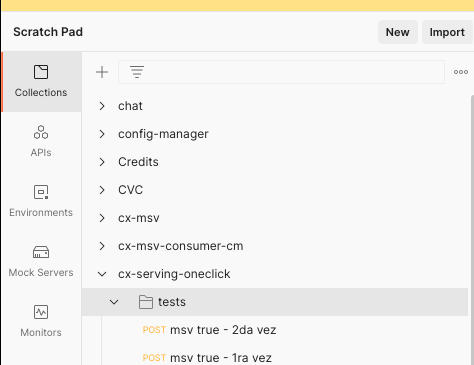
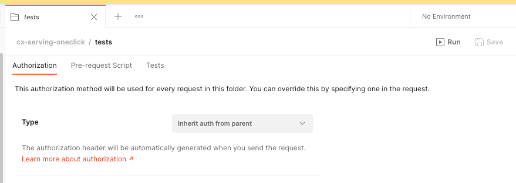
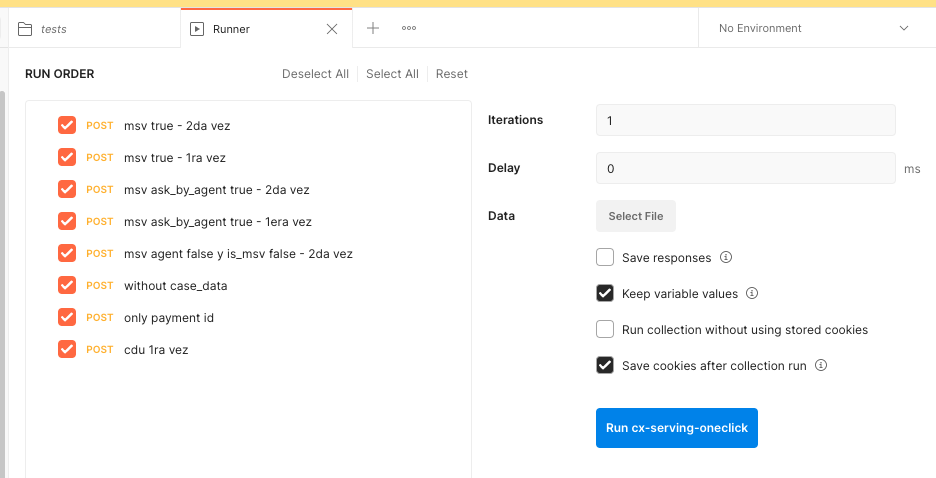

# Test Api Serving Web App  Oneclick
Automated tests for oneclick serving app mercadopago.

## Import
Download the file ***cx-serving-oneclick.postman_collection.json***. Open 
postman and import the file (go to File -> Import)

## Configuration
you need to create two variables in configurations in postman
Enviroment -> Globals (the configurations is using graphical interface)

```
url_test_serving = https://test--cx-serving-oneclick-mld.furyapps.io
token = Bearer xxxxxxx
```

## Execution
Ubicate the imported collection **cx-serving-oneclick** and select the folder test


Now, In the right section select the option run


selected the desired test to run and execute

